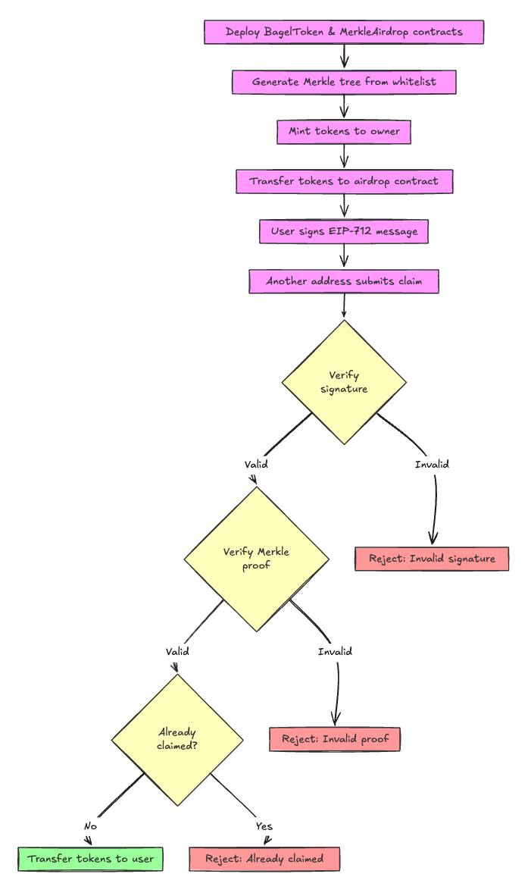

# Merkle Airdrop Project

A Solidity implementation of a token airdrop system using Merkle proofs and EIP-712 signatures for secure and gas-efficient token distribution.

## Overview

This project implements a token airdrop mechanism where:

1. Whitelisted users can claim their allocated tokens
2. Claims require both a valid Merkle proof and a signed message
3. Each address can only claim once
4. The system works on both Ethereum and zkSync Era networks

## Flow Charg



## Key Features

- ERC20 token (BagelToken) for distribution
- Merkle tree-based verification of eligible addresses
- EIP-712 signature verification for secure claims
- zkSync Era compatibility
- Comprehensive test suite
- Automated deployment scripts

## Project Structure

```
├── src/
│   ├── BagelToken.sol       # ERC20 token contract
│   └── MerkleAirdrop.sol    # Main airdrop contract
├── script/
│   ├── GenerateInput.s.sol  # Creates Merkle tree input
│   ├── MakeMerkle.s.sol     # Generates Merkle proofs
│   └── Interact.s.sol       # Contract interaction scripts
└── test/
    └── MerkleAirdrop.t.sol  # Test suite
```

## Prerequisites

- Foundry
- zkSync CLI (for zkSync deployment)

## Installation

```bash
forge install
```

## Usage

1. Generate Merkle tree input and proofs:

```bash
make merkle
```

2. Deploy contracts:

```bash
# For local testing
make anvil
make deploy

# For zkSync
make zk-anvil
make deploy-zk
```

3. Claim tokens:

```bash
make claim
```

## Testing

```bash
# Run Ethereum tests
forge test

# Run zkSync tests
make zktest
```

## License

MIT
